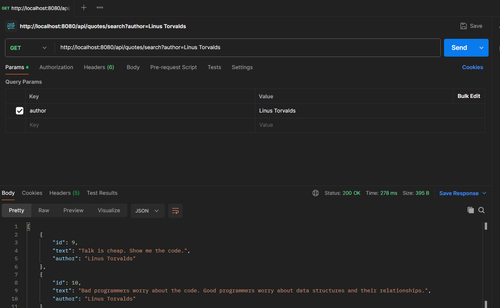

# Quotes API

A lightweight, stateless RESTful API built with Spring Boot for retrieving and searching inspirational quotes. Built in Week 5 of my [Java learning journey](../README.md).

---

## API Endpoints

| Method | Endpoint | Description | Sample Response |
| :--- | :--- | :--- | :--- |
| **GET** | `/api/quotes` | Retrieves all quotes available in the system. | `[{"id":1,"text":"The only way to do great work is to love what you do.","author":"Steve Jobs"}]` |
| **GET** | `/api/quotes/random` | Returns a single randomly selected quote. | `{"id":7,"text":"Life is like riding a bicycle. To keep your balance, you must keep moving.","author":"Albert Einstein"}` |
| **GET** | `/api/quotes/search` | Filters and retrieves quotes by author name via `@RequestParam`. | `[{"id":6,"text":"Strive not to be a success, but rather to be of value.","author":"Albert Einstein"}]` |

---

## Tech Stack

- **Language:** Java 17+
- - **Framework:** Spring Boot 3.x
  - - **Build Tool:** Maven
    - - **Dependencies:** Spring Web
     
      - ---

      ## How to Run

      ### Prerequisites
      - **JDK 17** or higher installed.
      - - **Maven** installed (or use the included Maven Wrapper `./mvnw`).
       
        - ### Steps
       
        - 1. **Clone the repository:**
          2.    ```
                   git clone https://github.com/moo-prog/java-learning-journey.git
                   cd java-learning-journey/week-5-spring-boot
                   ```

                2. **Build the project:**
                3.    ```
                         ./mvnw clean install
                         ```

                      3. **Run the application:**
                      4.    ```
                               ./mvnw spring-boot:run
                               ```

                            4. **Access the API:**
                            5.    The server will start at http://localhost:8080.
                        
                            6.---

                        ## API Testing Showcase

                  Below is a screenshot demonstrating a successful search request in Postman:

            
          
